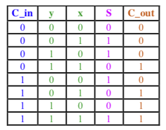
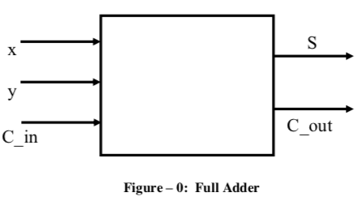
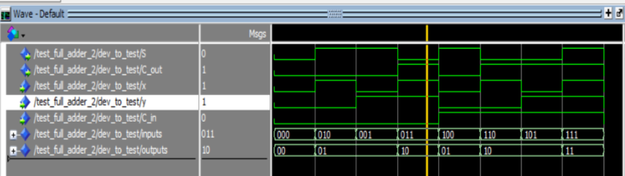
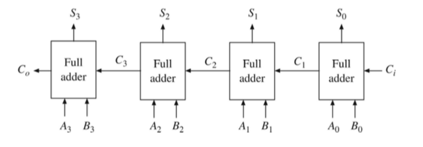

# Full Adder in VHDL

### SOFTWARE AND HARDWARE NEEDED
Notepad ++, ModelSim from Altera (Now Intel), Vivado from Xilinx and NEXYS4 DDR board.

Part 1: 

A full adder adds binary numbers and accounts for values carried in as well as out. A one-bit full adder adds three one-bit numbers. The full adder used in this project has x, y, and C_in as three inputs: x and y are the input bits, and C_in is the input carry bit. The two outputs are S (for sum) and C_out (for Carry out).

The working of the full adder is shown in the truth table below. The block diagram of a full adder is in Figure – 0.

After simulating the VHDL code in ModelSim, following waveform was generated.

Part 2:

The main purpose of the part 2 of the lab is to understand structural description in VHDL. Following two files are used for this part: 

P2_Full_Adder.vhd
P2_4_Bit_Full_Adder.vhd

4-Bit Full Adder (structural) is shown below:

I created a new Xilinx Vivado Project with the two files ((i) P2_Full_Adder_Text_Book.vhd and (ii) P2_4_Bit_Full_Adder_Text_Book.vhd) and tested the functioning of the full adder on the Nexys 4 DDR board.

The lab materials and the VHDL code have been provided by Jordan Christman. I have made modifications to existing code and filled in the code omitted (left blank) by the professor. 

